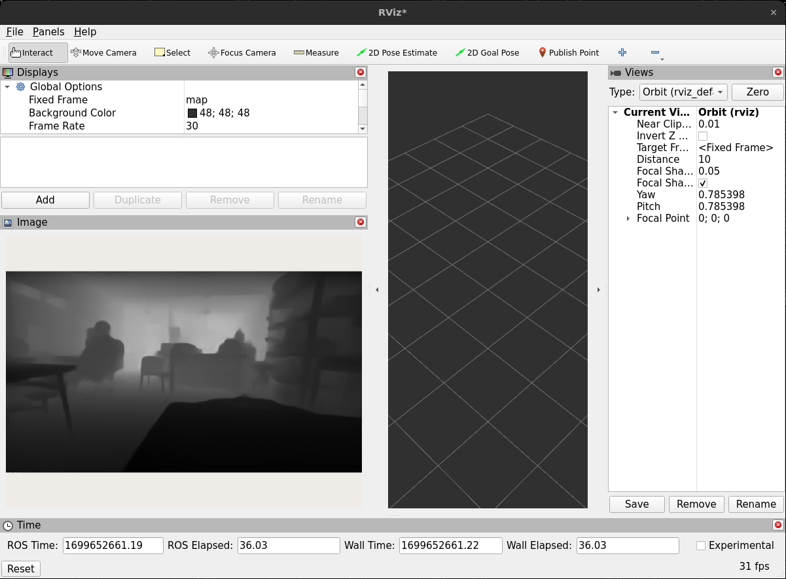

# DepthStream-Accelerator-ROS2-Integrated-Monocular-Depth-Inference
DepthStream Accelerator: A TensorRT-optimized monocular depth estimation tool with ROS2 integration for C++. It offers high-speed, accurate depth perception, perfect for real-time applications in robotics, autonomous vehicles, and interactive 3D environments.

## 🏁 Dependencies
1) NVIDIA Driver ([Official Link](https://www.nvidia.com/download/index.aspx))
2) CUDA Toolkit ([Official Link](https://developer.nvidia.com/cuda-downloads))
3) cuDNN ([Official Link](https://developer.nvidia.com/cudnn))
4) TensorRT ([Official Link](https://developer.nvidia.com/tensorrt))
5) OpenCV CUDA ([Github Guide](https://gist.github.com/raulqf/f42c718a658cddc16f9df07ecc627be7))
6) Miniconda ([Official Link](https://docs.conda.io/en/main/miniconda.html))
7) ROS 2 Humble ([Official Link](https://docs.ros.org/en/humble/Installation.html))
8) ZoeDepth ([Official Link](https://github.com/isl-org/ZoeDepth))

## ⚙️ Creating the Engine File
### ONNX File
Create the onnx file `cd monocular_depth/scripts/ZoeDepth/ && python trt_convert.py`. The ONNX file gets saved in the working directory as `zoe_nk.onnx`, configure the input dimensions as per your input image dimensions (h, w).
### TensorRT engine creation
Once you have the `.onnx` file created go into the tensorRT trtexec directory. Mostly this is `cd /usr/src/tensorrt/bin/`. Now it is time to create the engine file, this could take a few minutes to create. Run the command below,
`./trtexec --onnx=zoe_nk.onnx --builderOptimizationLevel=3 --useSpinWait --useRuntime=full --useCudaGraph --precisionConstraints=obey --allowGPUFallback --tacticSources=+CUBLAS,+CUDNN,+JIT_CONVOLUTIONS,+CUBLAS_LT --inputIOFormats=fp32:chw --outputIOFormats=fp32:chw --sparsity=enable --layerOutputTypes=fp32 --layerPrecisions=fp32 --saveEngine=zoe_nk.trt`

## 🖼️ Running Depth Estimation
### Build the ROS2 workspace
`colcon build --symlink-install --cmake-args=-DCMAKE_BUILD_TYPE=Release --parallel-workers $(nproc)`

### Inference
`ros2 launch monocular_depth mono_depth.launch.py trt_path:=zoedepth_nk.trt image_topic:=/rgb/image_rect_color gui:=true` *With GUI*.

`ros2 launch monocular_depth mono_depth.launch.py trt_path:=zoedepth_nk.trt image_topic:=/rgb/image_rect_color gui:=false` *Without GUI*.
#### GUI

    
    
DEPTH MAP

## 💬 ROS2 Message
The depth map gets published as `sensor_msg/Image` in the `/mono_depth/depthMap` topic

    

It can also be visualized in RVIZ2.
